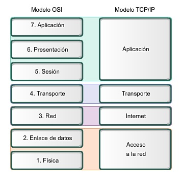
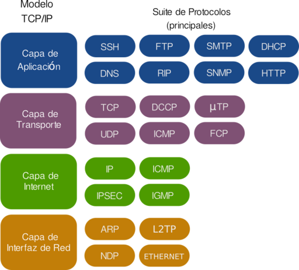

# Componentes de los Servidores de Red 

Para poder configurar correctamente cualquier servicio, se deben tener claros algunos conceptos relacionados con las redes informáticas.

## Protocolos

En el campo de las telecomunicaciones, un protocolo de comunicaciones es el conjunto de reglas normalizadas para la representación, señalización, autenticación y detección de errores necesario para enviar información a través de un canal de comunicación. Al conjunto de protocolos que aseguran la comunicaciones entre dos o más sistemas las denominamos pila de protocolos. Conocemos dos modelos, uno funciona como marco práctico (OSI) y el otro es el más utilizado en la práctica (TCP/IP). Los distintos protocolos trabajan directamente con sus iguales en el otro extremo de la comunicación.

En este módulo nos vamos a centrar en algunos de los protocolos más importantes de la capa de Aplicación.

## Direccionamiento IP:

Una dirección IP es una etiqueta numérica que identifica a un interfaz (elemento de comunicación/conexión) de un dispositivo (habitualmente una computadora) dentro de una MISMA red que utilice el protocolo IP (Internet Protocol), que corresponde al nivel de red del protocolo TCP/IP.

## Caracteristicas:

- Existen 5 clases.

- Nos interesan los tres primeros (A, B y C)

- Hay dos tipos de direcciones

    - Públicas

    - Privadas

- IPv4 vs IPv6

## Otros Parametros IP:

Además de la dirección IP, todo equipo necesita tener definidos otros parámetros para poder interactuar en la red correctamente.

- **Máscara de Subred**: La máscara permite distinguir los bits que identifican la red y los que identifican el host de una dirección IP.

- **Puerta de Enlace/Gateway/Pasarela**: Dirección del dispositivo que permite interconectada redes con protocolos y arquitecturas diferentes a todos los niveles de comunicación. *Obligatoriamente debe estar en la misma red que el equipo.*

- **Servidores DNS**: Direcciones de aquellos equipos encargados de traducir los nombres de dominio por su correspondiente IP. *Puede estar en una red externa.*
