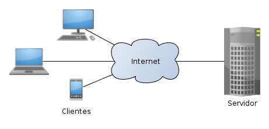
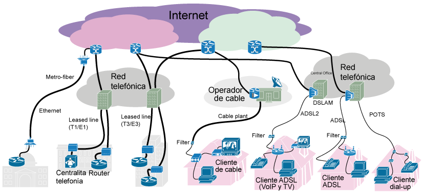

# Introducción

La finalidad de una red, bien sea local o de área extensa, es que los usurarios de los sistemas informáticos de una organización puedan hacer un mejor uso de los mismos mejorando de este modo el rendimiento global de la organización, mediante la utilización de servicios como:

* Acceso remoto a archivos.
* Correo Electrónico
* Acceso a información de hipertexto(pag. Web)
* Otros servicios(muchos de ellos transparentes para los usuarios)

# Conceptos previos

## Cliente servidor

Es la estructura en la que se basa el funcionamiento de los servicios de red. Es un modelo de aplicación distribuida en el que las tareas se reparten entre los proveedores de recursos o servicios, llamados servidores, y los demandantes, llamados clientes. Un cliente realiza peticiones a otro programa, el servidor, que le da respuesta. Especialmente adecuada para REDES de computadores.

Las características de ambos tipos de equipos suelen ser distintas:

|Cliente | Servidor|
|:-:|:-:|
|Menor potencia de cálculo|Mayor potencia de cálculo|
|Peticiones al srv.|Permanece a la espera|
|Interactuar con varios srv.|Gran número de peticiones|
|If visual+ Conectividad|Prioridad rendimiento y seguridad|

## Internet

No es más que un conjunto de redes locales interconectadas entre sí:

* LAN vs WAN
* La conexión se realiza a través de dispositivos denominados nodos
* Los servicios, en un principio, se ofrecen dentro de la red local.
* Para hacerlos públicos en Internet han de realizarse las correspondientes configuraciones.
