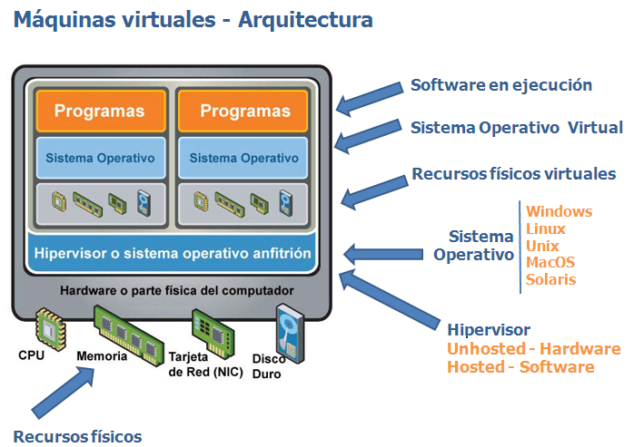
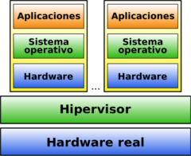
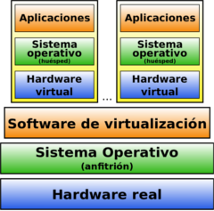
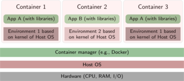
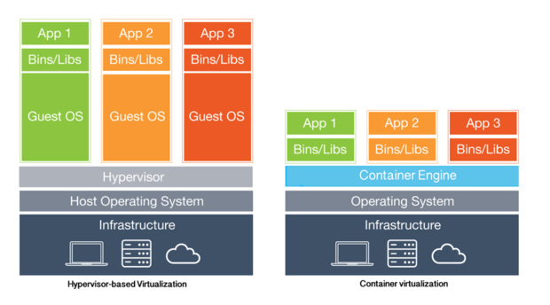

# Virtualización

El funcionamiento de los servidores hoy día no tiene nada que ver con lo que sucedía hace unos pocos años. Se ha pasado de un alojamiento en máquinas reales, las cuales incluso albergaban varios servicios, a trabajar con máquinas simuladas que ofrecen únicamente un servicio. Estas técnicas reciben el nombre de *Virtualización*. La virtualización de sistemas es una potente técnica de abstracción mediante la cual podemos crear una capa intermedia que se encarga de posibilitar la comunicación entre una máquina física (anfitrión o host) y el sistema o sistemas huésped (guest) virtuales.

### Ventajas

- Reducción de costes y mejor gestión de los recursos hardware. Cada máquina física puede usarse para varios propósitos a la vez, con los recursos adecuados.

- Sustitución de ordenadores por un fondo de MV (pool) que puedan ser creadas, clonadas y destruidas a demanda.

- Posibilidad de vender capacidad de cálculo a otras empresas (Virtual Private Servers).

- Simplificación de los sistemas de copia de seguridad. Entornos para aprendizaje y pruebas. Se simplifica el montaje y experimentación de otros sistemas operativos y software distinto al que usamos habitualmente. Ideal para estudiantes.

- Compatibilidad de programas. Posibilidad de usar programas que no ofrezcan versiones para nuestro sistema habitual.

- Entornos controlados. Se pueden probar programas en los que no confiamos,

- Fácil migración de unos ordenadores a otros.

### Inconvenientes

- Un único punto de fallo para todas las máquinas virtuales que se ejecuten en un único servidor físico. Para solucionarlo se deben utilizar servidores con un alto nivel de redundancia de discos, memoria, red, fuente de alimentación, y demás componentes (algo bastante más fácil de conseguir si trabajamos en entornos virtualizados)

Actualmente se asocia un único servicio a cada servidor, con el fin de limitar el alcance de un hipotético fallo.

## Herramientas

**TIPO 1:** Denominada **nativa o unhosted**, es software que se ejecuta directamente sobre el hardware, para ofrecer la funcionalidad. El hipervisor es un SO cuya única misión es gestionar conjuntos de clusters, Máq. Virtuales, unidades de almacenamiento, etc… 

Ejemplos

* Proxmox
* PowerVM (IBM)
* ESXi (VmWare)
* Xen
* OpenVZ

**TIPO 2:** denominada **hosted o paravirtualización**, es software que se ejecuta sobre un SO para ofrecer la funcionalidad(con la consiguiente penlización en rendimiento). 

Ejemplos

* Parallels (Windows/Mac/Linux)
* VMware (Windows / Linux)
* VirtualBox (Windows/Mac/Linux, Gratis)
* QEMU(Linux, Gratis)
* Windows Virtual PC (Windows, Gratis)

**CONTENEDORES:** Es una alternativa más de virtualización, que persigue mejorar el rendimiento y permitiendo el diseño de infraestructuras de trabajo más dinámicas. Posibilidad de aplicaciones de gestión automática (Kubernetes..)

Ejemplos

* Docker
* LXC/LXD
* Windows servers containers

**CLOUD virtualization**: Virtualización en sistemas remotos, con todas la ventajas del cloud computing (Azure, AWS, GoogleCloud..)

# Contenedores

Los contenedores(containers) son el siguiente paso en la evolución de la virtualización de sistemas operativos, su objetivo principal es OPTIMIZAR el uso de los recursos de la máquina anfitrión(host). Se puede entender como una virtualización a nivel de sistema operativo. Se evita la sobrecarga asociada con tener a cada huésped ejecutando un sistema operativo completamente instalado. Una desventaja de la virtualización basada en contenedores, sin embargo, es que cada invitado debe utilizar el mismo sistema operativo que utiliza el host, además de tener un menor nivel de aislamiento.

## Docker

Se ha impuesto como sistema de virtualización de aplicaciones mediante contenedores. Podemos encontrar muchos tutoriales y formaciones en la web 1. Varios aspectos destacan:

* Inicialmente creada para GNU/Linux. Actualmente también existe como aplicación para Windows 2010/2016/2019 Srv

* Los contenedores ofrecen un mejor rendimiento que las MV.

* Pueden crearse redes virtuales privadas de contenedores

* El núcleo es el Docker Engine, pero existen opciones para gestionar contenedores.

    - [Docker Compose](https://docs.docker.com/compose/) 
    - Docker Machine. Para poder ejecutar docker, debemos instalarlo previamente en nuestro SO (preferiblemente una MV Linux Server, donde ya viene incluido en los repositorios por defecto)

**Tareas:**

- Instalar docker y docker-compose en una máquina virtual Ubuntu Server

- Conseguir ejecutar comandos de docker sin necesidad de sudo.

- Descargar la imagen Hello-world del repoitorio oficial de docker.

- Listar las imágenes y contenedores existentes en tu MV, ejecutar la imagen anterior, comprobar su estado y finalmente borrar la imagen de tu MV.

- Ejecutar el contenedor httpd poniéndole como nombre web y redirigiendo al puerto 8080 del host(tu MV) el puerto 80 del contenedor. Prueba el acceso a la web.

- Modificar la ejecución anterior para que tu contenido web se encuentre en una carpeta real de tu MV.

- Ejecutar 4 veces más el contenedor con las mismas características que el caso anterior, en cada caso a los puertos 8081..8084 y con los nombres web2..web5

- Ejecutar el ejemplo de docker-compose incluido en el pie de página con éxito.

