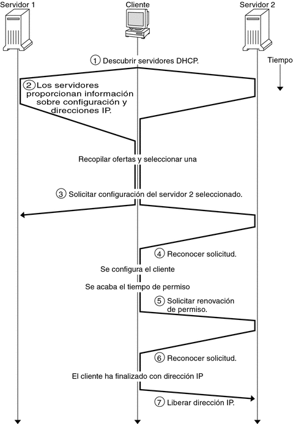

# DHCP

> DHCP es el acrónimo de Dynamic Host Configuration Protocol o en castellano protocolo de configuración de host dinámica.

El servicio DHCP permite la configuración de direcciones IP, máscaras, pasarelas por defecto (gateways) y otras muchas opciones de configuración de manera totalmente dinámica.

Una manera sencilla de entender el DHCP es imaginar que, al arrancar, los equipos clientes gritan por la red varias preguntas. El servidor del DHCP los contesta proporcionando toda la información necesaria para que sepan que equipo son y como tienen que configurar sus parámetros de red.

El administrador de red tiene la tarea de configurar los equipos que la componen. Esto significa configurar los servidores, los equipos clientes, concentradores, routers… Cada equipo de la red se tiene que identificar con la dirección IP correspondiente y la máscara de red, y generalmente dispondrá de un camino de acceso a Internet.

Tanto los usuarios como los servicios requerirán el acceso a otros equipos identificándolos por el nombre de dominio en lugar de hacerlo por la dirección IP, que es más difícil de recordar. Hacer esto equipo por equipo resulta un trabajo pesado y repetitivo si no se dispone de servicios de red que la faciliten.

## Configuración automática de red


El servicio DHCP proporciona un mecanismo de configuración centralizado de los equipos de la red. En lugar de configurar uno por uno los equipos de red con direcciones y valores estáticos, un servidor DHCP irá asignando a los equipos clientes los valores que los correspondan. Esta asignación se hace por un periodo de tiempo finito, pasado el cual habrá que renovarla.

Las principales ventajas de utilizar DHCP son, por un lado, evitar conflictos de direcciones IP (direcciones repetidas o erróneas), puesto que cambiar la configuración equipo por equipo es mucho más pesado y propenso a errores que hacerlo editando un único fichero de configuración en el servidor DHCP, y, por otro lado, hacer la administración centralizada representa un ahorro de tiempo y de trabajo.

>**Ventajas:**
>
> - Evita conflictos de IP
> - Centraliza y simplifica la administración
> - Ahorra tiempo

La concesión dinámica de direcciones IP y otros parámetros de configuración de red se realiza por un periodo de tiempo determinado, que varía en función de las necesidades del cliente y del servidor.

    
>El servicio DHCP simplifica la administración de la configuración de los equipos de red haciéndola centralizada, dinámica y con concesiones por periodos de tiempos finitos.


>Ejemplos de uso del servicio DHCP
>
>Los siguientes son algunos ejemplos de uso del servicio DHCP:
>
> - En una biblioteca que admite conexiones Wi-Fi, los clientes obtendrán concesiones por un tiempo reducido, por ejemplo, minutos.
> - Un usuario de Internet que recibe a su equipo de casa una dirección IP dinámica de su proveedor de acceso a Internet (ISP) tendrá una concesión que seguramente será por horas.
> - En la red corporativa de una empresa que se ha configurado dinámicamente usando DHCP, los equipos recibirán concesiones dinámicas por periodos de tiempos largos, por ejemplo, de días.
>

## Configuración de un equipo en la red


Cualquier equipo que pertenece en una red requiere que se configure con unos parámetros mínimos, que son la **dirección IP**, la **máscara** y la **puerta de enlace** por defecto (también llamada *gateway*). 
La dirección IP identifica el equipo de manera única y la máscara permite determinar la red o subred en que se encuentra el equipo. Con estos dos parámetros hay bastante para tener conectividad en la red. Si se quiere disponer de acceso fuera de la red propia (por ejemplo, a Internet o al resto de la red corporativa) hay que definir también el router o gateway. Aparte de la configuración básica, los equipos pueden necesitar (de hecho, lo necesitan) más parámetros de configuración, como, por ejemplo, el nombre del hueste, los servidores DNS a usar, el fichero de iniciación para arranques PXE…

>Todo equipo de red necesita disponer de una dirección IP que lo identifique de manera única en la red. Le hace falta también una máscara para poder distinguir en la dirección IP la parte de dirección de red y la de dirección de hueste. Finalmente, es imprescindible disponer de la dirección de la puerta de enlace predeterminada o pasarela por defecto (gateway), para disponer de acceso a redes externas.


>**Ejemplo de configuración de red de un equipo doméstico**
>
>La mayoría de usuarios disponen en casa de un equipo (o más) conectado a un router (router) que proporciona el acceso a Internet. Este equipo está configurado como cliente DHCP y al iniciarse recibe la configuración de red del router. Podéis comprobar en casa qué configuración tenéis. Una configuración de ejemplo podría ser:
>
>-----
>- Dirección IP. . . . . . . . . . . . .: 192.168.1.33
>- Máscara de subred . . . . . . . : 255.255.255.0
>- Puerta de enlace predeterminada . . : 192.168.1.1
>- Servidor DHCP . . . . . . . . . . : 192.168.1.1
>- Servidores DNS . . . . . . . . . . : 80.58.61.250 /
    80.58.61.254
>---

>**El inconveniente de la configuración estática**
>
>La configuración estática implica configurar los equipos uno a uno. Incluso aunque se tenga acceso remoto a los equipos (por Telnet o SSH), como que hay que modificar la configuración de red, no se puede hacer sentado desde el equipo del administrador, sino que hay que ir equipo por equipo a modificar la configuración.


Este proceso de configuración hace falta que se haga para cada equipo de la red. Hacerlo manualmente implica configurar equipo por equipo sin cometer errores al teclear las direcciones y las máscaras. Cualquier cambio en la estructura de la red, como por ejemplo redefinir las subredes o modificar algunas direcciones IP, significa volver a configurar manualmente los equipos implicados. Es evidente que todo este trabajazo no es agradable para el administrador de red (es muy aburrida!). Tanto si la red corporativa consta de pocos equipos como de muchos, hace falta una solución que permita automatizar la configuración de red de cada equipo de manera centralizada.

>Las opciones de configuración de red se pueden asignar a cada equipo estáticamente o se pueden configurar de manera dinámica utilizando DHCP.


Como administradores de red, la gestión centralizada que proporciona DHCP nos permite modificar la red añadiendo, eliminando y redefiniendo equipos con un coste mínimo.

## Tipos de asignaciones de direcciones IP
Cada equipo de red tiene asignada una dirección IP que lo identifica de manera única dentro de la red. La composición de la dirección IP y la máscara determinan la red o subred a la cual pertenece. Además, se configuran otros parámetros de red como la puerta de enlace predeterminada, servidores DNS… Esto se puede configurar manualmente yendo equipo por equipo e introduciendo esta información.

>Cuando la dirección IP y los otros parámetros necesarios de configuración de la red se configuran equipo por equipo, manualmente, se llama que tienen una dirección IP estática.

Cuando la configuración de red de un equipo no se hace manualmente y localmente en el equipo sino que se hace por medio de un servidor DHCP, se llama que el equipo utiliza una **dirección IP dinámica**. Para realizar configuraciones de red dinámicamente harán falta uno o más servidores DHCP (a manera de redundancia), que proporcionarán la configuración a los equipos clientes (los que hay que configurar). Por lo tanto, será una estructura cliente/servidor. Las direcciones IP dinámicas que recibe el cliente las podemos clasificar en dos categorías: **asignación dinámica de rango** y **asignación fija**.

El servidor DHCP dispone de un rango de direcciones que puede asignar a los clientes que piden una dirección IP. Cuando el servidor asigna una dirección cualquiera del rango al cliente (al azar) se trata de una asignación dinámica de rango. El cliente no sabe qué dirección IP tendrá y no hay manera de predecir qué se le concederá en una futura configuración. A cada nueva asignación, la dirección IP puede ser diferente.

>**MAC**
>
>Cada interfaz de red se identifica de manera única físicamente por la dirección MAC (media access control o dirección de acceso al medio).

Una asignación fija se produce cuando el servidor DHCP asigna siempre la misma dirección al cliente. Para asignar siempre la misma dirección IP al cliente hace falta que el servidor pueda identificar inequívocamente el cliente (por la dirección MAC). El servidor dispone de una mesa con las correspondencias entre las direcciones MAC y las direcciones IP fijas.

>Cuando la configuración de red de un equipo se hace por medio de un servidor DHCP se llama que utiliza una dirección IP dinámica. Esta dirección puede variar dentro de un rango de direcciones disponibles del servidor DHCP o puede ser fija.

>**DNS dinámico**
>
>Hay servicios de DNS dinámico *(DDNS)* que permiten asignar un nombre de dominio a equipos con dirección IP dinámica.

Las ventajas de disponer de una dirección IP fija son que vuestra identificación a Internet (vuestra dirección IP) no varía y todo el mundo os puede identificar siempre por la misma IP. Podéis proporcionar servicios a otros equipos y los clientes os identifican siempre con la misma dirección sin tener que recordar en cada momento qué dirección IP tenéis hoy (como pasa en el caso de una IP dinámica).

# Funcionamiento del protocolo DHCP

El protocolo DHCP está descrito, como la mayoría de protocolos de red, por un documento oficial llamado RFC. Este documento ha sufrido una evolución a lo largo de los años para irse adaptando a las necesidades de cada momento. Todo protocolo implica un diálogo entre los equipos que intervienen en un proceso. Nos hará falta, pues, analizar cuál es y como se produce este diálogo. Finalmente se describirá el significado de termas tan usuales en el DHCP como rangos, exclusiones, concesiones y reservas.

>**RFC**
>
>**Request for Comments (RFC)** son memorándums sobre nuevas investigaciones, innovaciones y metodologías relacionadas con las tecnologías de Internet. Los publica el **Internet Engineering Task Fuerzo (IETF)** y definen a escala mundial los protocolos y sus revisiones. Es decir, son las publicaciones oficiales que describen los protocolos.

## Evolución del protocolo DHCP

El servicio DHCP es un servicio del tipo cliente/servidor que proporciona la configuración de red a los clientes que lo solicitan. Proporciona los parámetros básicos de red como la dirección IP, la máscara de red, la puerta de enlace y otros parámetros necesarios para la conexión en una red IP. Se trata de un protocolo de la capa de aplicación del modelo TCP/IP.

>El protocolo DHCP está basado en la arquitectura de servicios cliente/servidor y utiliza como transporte el protocolo UDP de la pila de protocolos TCP/ IP. El servidor DHCP se comunica con los clientes utilizando paquetes UDP, que recibe en su puerto 67 y envía al puerto 68 del cliente.

La configuración dinámica de equipos de red se inició con el protocolo BOOTP (BOOT Strap Protocolo o protocolo de arranque). Era un protocolo más básico que principalmente permitía definir la dirección IP, la máscara de red y la pasarela por defecto para el cliente. El BOOTP (RFC 951, año 1985) es un protocolo pensado para proporcionar automáticamente la IP a clientes de red en el proceso de arranque. Originariamente se utilizaba para estaciones de trabajo sin disco que obtenían la configuración de red del protocolo BOOTP y también obtenían el nombre de un fichero de arranque que se tenía que bajar por medio del TFTP, que usualmente era el sistema operativo.

>**RFC del DHCP**
>
>Principales RFC dedicados al DHCP:
>
>- RFC 2131, marzo 1997: “DHCP: Dynamic Hueste Configuration Protocolo”
>- RFC 2132: “DHCP options”
>- RFC 3396: “Encoding long options”
>- RFC 4361: “Nodo-specific cliente identifiers for DHCPv4”
>- RFC 8415: “DHCPv6: Dynamic Hueste Configuration Protocolo Ipv6”


El BOOTP dio al protocolo DHCP, que es una evolución con muchas más prestaciones. El DHCP surge el octubre de 1993 mediante el RFC 1531. Rápidamente evoluciona gracias a varios RFC, como el RFC 1541 (el mismo 1993), que será sustituido por el RFC 2131, el marzo del 1997. Este documento es la base del protocolo DHCP actual. A grandes rasgos, el protocolo se describe en el RFC 2131 para redes Ipv4, el conjunto de opciones de configuración de DHCP se describen en la RFC 2132 y la especificación del DHCP para redes Ipv6 es en la RFC 8415.

## El modelo funcional del protocolo DHCP

El protocolo DHCP describe el diálogo que se produce entre cliente y servidor para la concesión de configuraciones IP. En una red con configuración de equipos dinámica, uno o más servidores DHCP escucharán las peticiones de los clientes en el puerto 67. Los clientes DHCP solicitarán al servidor DHCP una configuración IP y empezará un proceso de negociación que tiene que acabar (si todo va bien) con la concesión de una dirección IP al cliente. Los servidores hablan al puerto 68 de los clientes.



>**Puertos DHCP**
>
>El protocolo DHCP utiliza UDP en la capa de transporte. Utiliza dos puertos:
>
>   - Puerto 67, escucha el servidor.
>   - Puerto 68, escucha el cliente.

La negociación que se establece se puede definir a grandes rasgos de la manera siguiente:

1. El cliente solicita una dirección IP (de hecho, una configuración de red).
2. El servidor mira las direcciones IP disponibles dentro del rango de direcciones dinámicas de que dispone para conceder y ofrece una al cliente.
3. Si el cliente lo acepta, envía una solicitud al servidor para hacerla suya.
4. Si al servidor le parece bien, acepta la petición del cliente y le confirma que puede utilizar esta dirección IP, que se lo concede por un periodo de tiempo limitado.

Los siguientes son los tipos de paquetes DHCP:

- *DHCP discover*
- *DHCP offer*
- *DHCP request*
- *DHCP ack / DHCP nack*
- *DHCP decline*
- *DHCP release*
- *DHCP information*

### DHCP 'discover'

En un proceso de configuración dinámica de un cliente de DHCP, el paquete DHCP discover es lo primero que se envía. Lo envía el cliente para pedir una configuración IP a algún servidor. Generalmente, el cliente se acaba de inicializar y quiere obtener una configuración dinámica de red. El cliente no sabe en qué red pertenece (no tiene dirección IP ni máscara de red) ni tampoco sabe qué servidores DHCP hay en la red (si hay jefe).

Por lo tanto, el cliente genera un paquete de difusión (broadcast) destinado a todos los equipos de la red donde solicita una configuración IP. En la red puede haber jefe, uno o más de un servidor DHCP para atender esta petición. Es responsabilidad del administrador de redes configurar correctamente la estructura y los servicios de red, de forma que si define clientes de DHCP haya servidores DHCP que atiendan sus peticiones.

### DHCP 'offer'

Al recibir una solicitud de configuración de un cliente (DHCP discover), un servidor DHCP mira de atenderla proporcionando una dirección IP del rango de direcciones dinámicas que gestiona ( puede haber más de un servidor DHCP en la misma red).

El servidor trata de asignar una IP del conjunto o rango (también denominado pool) de direcciones dinámicas que gestiona. Para hacerlo, tiene que mirar cuáles de las direcciones le quedan libres y disponibles para conceder al cliente. Cada vez que el servidor concede una dirección IP a un cliente lo anota en un fichero de registro de las concesiones efectuadas. Cada vez que finaliza una concesión el servidor puede volver a utilizar la dirección IP para otro cliente.

Toda concesión (o lease) DHCP es por un periodo determinado de tiempo, y una vez transcurrida hay que renovarla.

El mecanismo que utiliza el servidor para escoger la dirección IP dentro del conjunto de direcciones IP disponibles varía en función del programa de servidor que se utilice. Además, se pueden configurar innumerables opciones del servidor para establecer como se tienen que hacer las concesiones. Un caso típico es el de las direcciones fijas. A un determinado cliente se le asigna siempre la misma dirección IP. Por eso hay que disponer de la lista de direcciones MAC de los clientes a los cuales se quiere asignar una dirección IP fija.

El servidor selecciona una dirección IP disponible y la reserva para el cliente (todavía no está asignada). A continuación envía un paquete DHCP offer (unidestinació o unicast) al cliente con toda la información de configuración requerida. La dirección IP y MAC origen identifican el servidor que hace la oferta. El destinatario se indica por su dirección MAC (que es conocida). El campo IP del destinatario es la dirección IP que el servidor ofrece (pensáis que el cliente todavía no tiene dirección IP). Otro concepto importante es por cuánto tiempo se realiza la concesión. El paquete incluye campos para completar el resto de configuración de red, por ejemplo, la puerta de enlace por defecto, los servidores DNS…

### DHCP 'request'

Cuando el cliente recibe una oferta de configuración IP por parte de un servidor, la puede aceptar o rechazar. Si el cliente no acepta la oferta, simplemente realizará un nuevo DHCP discovery. Esto es suficiente porque el servidor se dé cuenta que la oferta ha sido rechazada.

Si el cliente acepta la oferta, lo tiene que comunicar al servidor. El mecanismo para hacerlo es mediante un paquete DHCP request enviado otra vez por difusión. A estas alturas, el cliente todavía no dispone de la dirección IP para utilizarla. El servidor lo ha reservado, pero todavía no ha dado el sí definitivo porque sea concedida al cliente.

El motivo por el cual el cliente pide quedarse la concesión (DHCP request) que ha recibido utilizando difusión es hacer público a todo el mundo de la red que ha aceptado una oferta de un servidor DHCP concreto. Recordáis que la petición del cliente se hace por difusión y, por lo tanto, puede recibir ofertas de diferentes servidores DHCP. Cuando acepta una de las ofertas, no tiene que decir nada a los otros servidores que ha rehusado. Simplemente haciendo pública qué oferta acepta, el resto de servidores DHCP entienden que su oferta se ha rechazado.

### DHCP 'acknowledgement' (DHCPACK/*DHCPNACK)

El último paso en una negociación DHCP básica lo realiza el servidor cuando finalmente autoriza la concesión enviando el paquete DHCPACK (DHCP akcnowledgement). A partir de este momento, el cliente ya puede hacer uso de la dirección IP y de la configuración de red recibida. DHCPACK incluye toda la información en lo referente a la duración de la concesión y los datos necesarios para gestionar cuando expira.

El servidor anotará en el registro de concesiones la que acaba de realizar y detallará todos los aspectos, en especial el tiempo de concesión. El paquete de aceptación de la concesión DHCPACK es un paquete unidestinació dirigido a la MAC del cliente. Recordáis que el cliente todavía no dispone de una dirección IP válida; dispondrá al recibir el DHCPACK.

Cuando un servidor DHCP detecta que la IP que había reservado para un cliente y que le iba a conceder ya está en uso (por una configuración incorrecta), el servidor envía al cliente un paquete DHCPNACK e indica la no autorización de la concesión. El cliente que recibe un DHCPNACK tiene que volver a iniciar todo el proceso de negociación empezando otra vez por el DHCP discovery.

### DHCP 'decline'

Por su parte, el cliente también puede examinar la dirección IP ofrecida por el servidor para comprobar si está en uso o no. Puede hacer otras pruebas para ver si le parece correcta o no la oferta recibida del servidor. Por ejemplo, en el caso de renovación de una dirección IP, el cliente puede recibir una IP diferente a la que utiliza y no interesarle. En estos casos, el cliente puede enviar un paquete DHCP declino al servidor para indicar que su oferta ha sido rechazada.


### DHCP 'release'

Cuando un cliente ya no necesita más el uso de la configuración IP que ha recibido, la puede liberar enviando al servidor un paquete *DHCP release*. Al hacerlo, el servidor añade la dirección IP al conjunto de direcciones dinámicas que tiene disponibles. También hace la anotación pertinente en el registro de concesiones (leases) para indicar que ha finalizado el uso de la dirección. De todos modos, muy a menudo el cliente no puede llegar a emitir este paquete porque es apagado por el usuario sin dejar tiempo al sistema para liberar la IP.

### DHCP 'information'

En cualquier momento el cliente puede solicitar más información sobre la configuración de red al servidor utilizando un paquete *DHCP information*. En el paquete DHCP offer que el servidor envía al cliente, constan las informaciones generales de configuración de red que se envían en la oferta: dirección IP, máscara de red, puerta de enlace predeterminada, servidor DNS, fichero a bajar para arranques PXE y otros muchos parámetros que pueden estar configurados para enviarse en la oferta. El cliente puede volver a pedir al servidor la información de estos parámetros o puede solicitar información para la configuración otros parámetros (WINS, NetBIOS, hostname…). El cliente solo puede realizar una petición de información DHCP information al servidor una vez está configurada.

### Petición de renovación/concesión de una IP concreta

El proceso de cuatro fases usuales de DHCP consistente en *discovery / offer / request / ack* se produce cuando el cliente solicita una dirección IP de nuevo. Sabemos que las concesiones son por un intervalo de tiempo finito, pasado el cual hace falta que el cliente pida la renovación. Existe, pues, un proceso de renovación simplificado. El cliente pide continuar usando la misma dirección IP con un paquete DHCP request y el servidor le concede o no con los paquetes DHCP ACK/*NACK.

Otro caso es un cliente que pide usar (renovar) una dirección IP que el servidor no le puede conceder (está en uso, no es del rango que gestiona…). En esta situación, el servidor envía un DHCP NACK.

## Ataques al funcionamiento del DHCP

Como cualquier otro servicio de red, el servidor DHCP es susceptible de sufrir ataques malintencionados. El ataque más fácil y clásico es el DDOS o denegación de servicio. Consiste a inundar de peticiones un servidor para saturarlo y bloquear su funcionamiento. Un cliente puede realizar varias peticiones DHCP discovery fingiendo que son clientes diferentes (enmascarando su MAC) con la intención de agotar las direcciones IP disponibles del servidor o simplemente con la intención de sobrecargarlo con tantas peticiones que no dé al alcance a atenderlas o que lo haga lentamente.

Otro tipo de ataque consiste en falsear la información que se envía al cliente. El cliente hace una solicitud de IP en forma de difusión (broadcast) y su petición puede ser atendida por uno o más servidores DHCP. Uno de esos servidores puede ser un atacante que intenta proporcionar información de configuración falsa al cliente, por ejemplo, indicando un servidor DNS también malicioso. Este puede falsear las identidades de las máquinas de la red y que cuando el cliente se dirija a su entidad bancaria el servidor DNS en realidad le proporcione una IP de una máquina que falsea la de la entidad bancaria.

### Tipo de ataques DNS

+ Clientes no autorizados: acceso a servidores DNS por parte de clientes no autorizados.
+ Servidores no autorizados: servidores DNS impostores que suplantan los verdaderos servidores.

## Conflictos con las direcciones IP

Uno de los principales motivos para utilizar DHCP es simplificar el proceso de configuración de red y minimizar los conflictos con las direcciones IP. Por desgracia, esto no garantiza que no se puedan producir conflictos. Por ejemplo, nos podemos encontrar en situaciones en que dos máquinas diferentes tengan la misma IP por una simple mala configuración del servidor DHCP. Otro caso típico es el de un cliente que se ha configurado él mismo una IP estática cuando en la red ya había un equipo que utilizaba la misma dirección IP asignada por el servidor DHCP.

Un problema habitual para los administradores poco experimentados es definir una configuración de red local al cliente (hostname, servidor DNS, puerta de enlace a utilizar…), pero pedir la dirección IP dinámicamente. La configuración dinámica no es solo la IP y la máscara sino que el servidor DHCP puede proporcionar otros parámetros de red que sobrescribirán los que el cliente tenía definidos localmente (este es el objetivo del DHCP!).

## Rangos y concesiones

Los clientes DHCP obtienen del servidor una configuración de red. Describimos ahora algunos de los términos que aparecen en este proceso y que forman parte de la configuración DHCP.

- **Rango**: denominan rango de direcciones IP el conjunto de direcciones dinámicas que el servidor tiene disponibles para asignar a los clientes. Las direcciones IP disponibles se agrupan para ofrecerse a las diversas subredes que atiende el servidor. Una misma subred puede disponer de varios rangos.

- **Exclusiones**: entendemos por exclusiones aquellas direcciones IP que no se ofrecen dinámicamente por parte del servidor. Es decir, que no forman parte de ningún rango.
- **Concesiones**: la asignación de una dirección IP y el resto de parámetros de red a un cliente por parte del servidor es una concesión o lease. Los clientes reciben las concesiones por periodos de tiempos finitos que, al finalizar, hay que renegociar. Tanto el cliente como el servidor se anotan las concesiones, el cliente la que recibe y el servidor las que concede. Cuando finaliza una concesión, el servidor puede decidir revocarla o ampliarla.

El cliente puede decidir renunciar a la concesión en cualquier momento. Si el cliente quiere alargar la concesión inicia un diálogo DHCP abreviado con el servidor que puede acabar con una renovación o con la pérdida de la concesión (siempre puede volver a empezar el proceso). Tanto el servidor como el cliente miran normalmente las concesiones que se han efectuado entre ellos con anterioridad para, si es posible, repetir la misma asignación.

- **Reservas**: denominamos reservas aquellas direcciones IP que se asignan por DHCP pero de manera fija. Es decir, son direcciones que se asignan dinámicamente pero siempre y únicamente a un hueste determinado. Fijaos que a pesar de ser una dirección dinámica solo se utiliza si el hueste asociado hace uso. Si el hueste está apagado, la dirección no se puede usar para otras huestes, está reservada.

### Un ejemplo de rango:

```
subnet 140.220.191.0 netmask 255.255.255.0 {
            range 140.220.191.150 239.252.197.250;
}

subnet 239.252.197.0 netmask 255.255.255.0 {
            range 239.252.197.10 239.252.197.107;
            range 239.252.197.113 239.252.197.250;
}
```

Se puede ver que la primera subred tiene un rango de 101 direcciones dinámica comprendida entre 150 y 250. La segunda subred permite asignar dos rangos de direcciones no correlativos. 

### Un ejemplo de reserva

```
subnet 140.220.191.0 netmask 255.255.255.0 {
       host asirserver {
           hardware ethernet 08:00:2b:4c:59:23;
           fixed-address 140.220.191.1;
       }
      range 140.220.191.150 239.252.197.250;
       }
```

140.220.191.1 es una dirección reservada exclusivamente para el host asirserver.

## DHCP, en cliente-servidor

El servicio DHCP es un más de los servicios de red que tienen la estructura cliente/servidor. Los servidores DHCP son los equipos que tienen en ejecución el programa servidor. Es el programa encargado de atender las peticiones de los clientes y ofrecerles la configuración de red, llevando el registro de las IP que concede y de todas las acciones que realiza. Los clientes DHCP son aquellos equipos que realizan peticiones a un servidor DHCP para obtener una configuración de red.

> ISP: Proveedor de Servicio de Internet

### Cliente DHCP

Un equipo cliente DHCP es un equipo que solicita la dirección IP y otros parámetros de configuración de red a un servidor DHCP en lugar de tenerlos definidos localmente en el equipo.

Si conectáis vuestro equipo informático en la red Internet por medio de un ISP (*Internet service provider* o proveedor de acceso a Internet), seguramente recibiréis una IP dinámica de vuestro proveedor. Cuando se realizaba una llamada telefónica con módem y usando el protocolo PPP (Point tono Point Protocolo o protocolo punto a punto), el proveedor proporcionaba una dirección IP dinámica. Si utilizáis ADSL y un *router*, seguramente el router os proporciona una dirección IP dinámica privada al ordenador de casa. Al mismo tiempo, el router obtiene una dirección IP dinámica pública del proveedor. Estas direcciones IP dinámicas son fijas (siempre las mismas) o dinámicas de rango (puede ser cualquier dirección IP del conjunto de direcciones IP que tiene disponibles para conceder el servidor DHCP).

>**El router: servidor y cliente DHCP**
>
>Un caso típico en una red privada a casa es disponer de un router ADSL conectado a un proveedor ISP. El router actúa como cliente DHCP en su interfaz de red pública (la del ADSL), la que conecta en Internet.
>
>A la vez, el router hace usualmente de servidor DHCP para los ordenadores de casa proporcionándolos una dirección IP. En general los ordenadores de los usuarios se configuran como clientes DHCP.


El cliente DHCP tiene que tener en funcionamiento un demonio encargado de la gestión de las tareas DHCP propias del cliente. Realiza la parte de negociación encargada al cliente (*DHCP discovery, request*) y también lleva un registro de las concesiones (leases) recibimientos. Este registro es el que utiliza el cliente para volver a pedir la misma IP que tenía anteriormente. Una vez recibida la concesión, lo programa cliente queda “dormido”, pendiente de volverse a ejecutar automáticamente cuando haya que renegociar la concesión. Sin intervención del usuario, lo programa cliente se activa y sigue el procedimiento necesario para renegociar la dirección IP cada vez que el tiempo de la concesión se agota.

>**Configuración cliente**
>
>Usualmente, las configuraciones cliente se pueden hacer de tres maneras diferentes:
>
>- Fichero de texto: editar directamente los ficheros de configuración.
>- Menús en modo texto: usando algún programa de menús con interfaz de texto.
>- Aplicación gráfica: usando una aplicación de ventanas en el entorno gráfico.

Los programes cliente varían de un sistema operativo a otro y la manera de ejecutarlos también. Generalmente se dispone de un cliente ejecutable en modo texto o órdenes y de una interfaz gráfica (GUI, *graphics user interface* o interfaz gráfica de usuario) para la configuración. No hay que decir que los sistemas Windows tienden a la configuración gráfica usando ventanas y a la configuración y ejecución interna a escondidas del usuario. Normalmente, en los sistemas GNU/Linux la configuración se hace usando ficheros de texto u opciones que se dan a órdenes ejecutables. La interfaz gráfica acostumbra a ser un frontend para gritar la orden. Según sea el sistema operativo se puede consultar el fichero de registro de las concesiones recibidas por el cliente, el fichero de leases, más o menos en detalle.

Generalmente, lo programa cliente se puede configurar para definir como se comunicará con el servidor: información a pedir, información a proporcionar al servidor, opciones por defecto…

### Servidor DHCP

El administrador de red es el encargado de pensar la ubicación del servidor o servidores DHCP en la estructura corporativa. Cuanto más complicada sea la topología de la red, más difícil será la gestión. Una red corporativa básica puede disponer de un único servidor DHCP que ofrece sus servicios a todos los equipos de la red. Los clientes pueden estar en una misma subred o en varias subredes, pero todas con conectividad con el servidor DHCP. Este también puede ser el esquema de una red privada a casa, donde un router (lo del ISP, por ejemplo) proporciona el servicio DHCP a todos los ordenadores de la casa.

Si la red corporativa crece y pasa a tener subredes segmentadas con cortafuegos, la configuración del servidor DHCP se complica. Si se quiere continuar disponiendo de un único servidor para toda la red, hará falta que los cortafuegos (firewalls) dejen pasar los paquetes DHCP entre las subredes y el servidor. Otra opción es poner un servidor DHCP para cada subred o grupos de subredes. Haciéndolo así, la administración de cada servidor es más sencilla, pero hay más servidores a administrar. Una red con una casuística completa es la que tiene varios servidores DHCP para varias partes de la red y cortafuegos entre clientes y servidores que tienen que permitir el paso de paquetes DHCP.

Si el servidor DHCP es el encargado de dar direcciones IP a los clientes, quién le proporciona una dirección IP a él? Lo hace o bien otro servidor DHCP (y podríamos volver a hacer la misma pregunta indefinidamente) o bien el administrador. Usualmente, en una red corporativa el servidor DHCP utiliza una IP estática definida por el administrador. Esto le permite estar siempre disponible para los clientes con la misma IP y no lo hace depender de un servidor externo.

Hay varios programas servidores DHCP que se pueden clasificar en dos grandes grupos: los que trabajan en modo texto y los que lo hacen en modo gráfico. Cada administrador trabaja con sus herramientas preferidas. Las tareas básicas para aprender a utilizar un servidor DHCP son: observar, hacer una lista de la configuración actual, activar/parar el servicio, modificar la configuración, monitorizar los logs (registro de sucesos del servicio) y, evidentemente, saber instalar y desinstalar la aplicación servidor.

Como la mayoría de servicios de red, el servicio DHCP se ejecuta en segundo plan en forma de demonio. El servidor DHCP siempre está puesto en marcha escuchando en el puerto 67 las peticiones que recibe de los clientes. Cuando recibe una petición entrante, el programa ejecutable del servidor DHCP la procesa y pone en marcha todo el mecanismo DHCP pertinente para volver a escuchar nuevas peticiones. De hecho, el servidor siempre escucha peticiones y las procesa simultáneamente (según la configuración).

Los ficheros del registro del servicio, donde se anotan las concesiones, mantienen la información aunque el servicio se pare o que el servidor se apague. Al volver a ponerlo en marcha se leerán de nuevo los ficheros de registros para saber cuáles son las concesiones que se habían realizado.